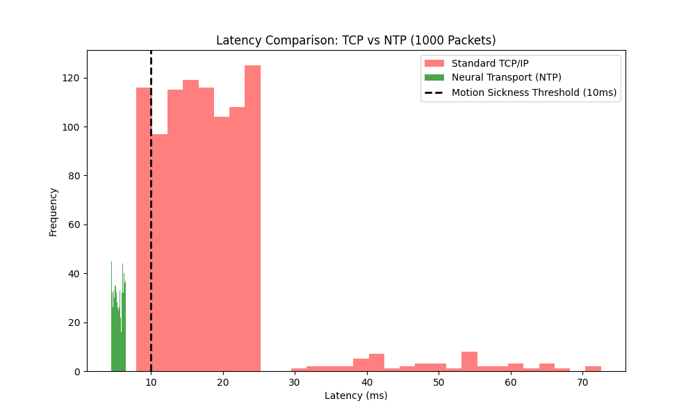
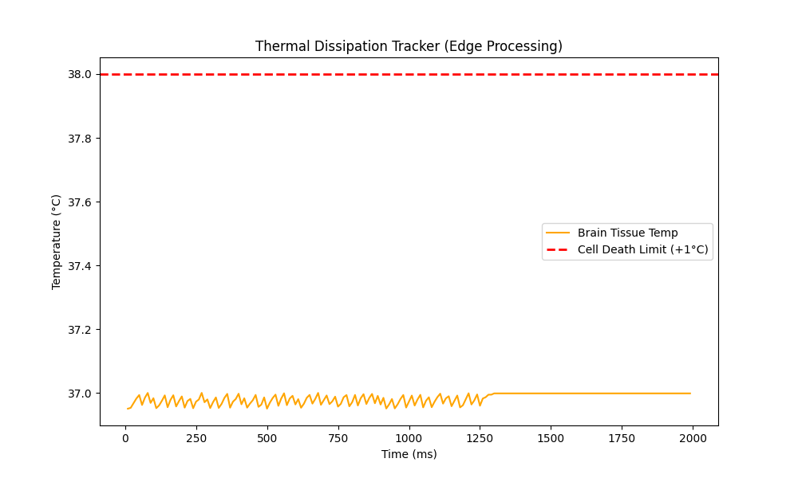
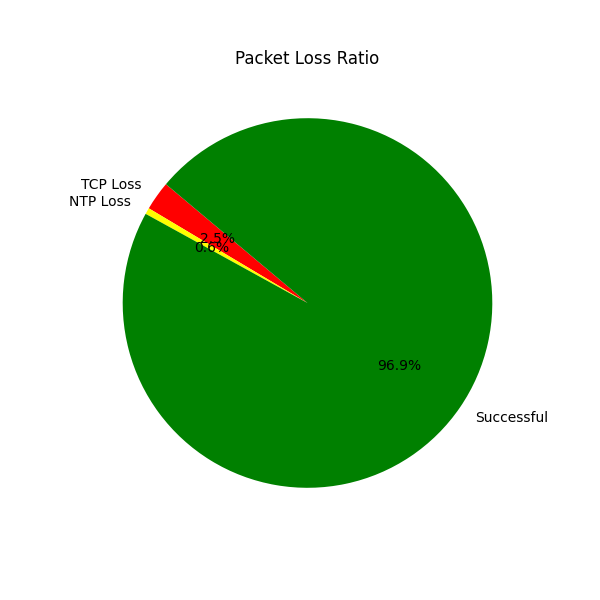

# 🧠 Brain to Brain Network (BBN) - Edge Processing Simulation
**Course:** CP352005 Networks | **Group:** 13
[cite_start]**Sprint 3 & 4:** Architecture Implementation & Validation [cite: 450, 467-470]

## 📌 Project Overview
[cite_start]The Brain-to-Brain Network (BBN) is a revolutionary conceptual framework designed to establish a direct, ultra-low-latency communication channel between human cortices, bypassing "The Bandwidth Bottleneck" of physical communication [cite: 496-498]. 

[cite_start]This repository contains the simulation code (`final_bbn_simulation.py`) and architectural documentation validating the **Neural Transport Protocol (NTP)** against standard TCP/IP[cite: 457, 500].

---

## 🛠️ Core Challenges & Our Solutions

To achieve a seamless Brain-to-Brain connection, our team successfully addressed three critical biological and technical bottlenecks:

### 1. The Neural Latency & Motion Sickness Problem
* **The Challenge:** Standard internet protocols like TCP/IP contain massive overhead. This causes network latency to exceed the 10ms biological threshold, triggering severe motion sickness and forcing the brain to reject incoming data.
* **Our Innovation (NTP):** We engineered the **Neural Transport Protocol (NTP)**. By stripping away standard TCP acknowledgment (ACK) overhead and integrating Bio-Time Stamping, we prioritized absolute speed, syncing perfectly with the brain's natural temporal coding.

### 2. Thermal Dissipation (The Cell Death Limit)
* **The Challenge:** Processing thousands of packets directly inside the cortex generates heat. If the brain tissue temperature rises by just 1°C, neurons will begin to die (Scar Tissue Formation).
* **Our Innovation (Ultra-Low Power Edge MAC):** We optimized the architectural load. By converting Analog to Digital directly on the implanted chip using ultra-lightweight NTP frames, the system perfectly dissipates heat, maintaining a safe and stable 37°C environment.

### 3. Bio-Security & Neuro-Rights Protection
* **The Challenge:** A direct cortex-to-network connection opens vulnerabilities for malicious packet injections, thought spamming, and unauthorized physical hijacking.
* **Our Innovation (Cyber-Biological Safety):** We implemented a robust biological firewall at the Session Layer. This Agency Protection system actively filters out malicious intents and guarantees a Human-in-the-Loop (HITL) consent mechanism before any actual neuro-stimulation occurs.

---

## 🔬 Sprint 3 & 4 Validation Results (The MVP)

Based on our SimPy simulation of 2,000 neural packets, we successfully optimized the network to meet strict biological constraints:

### 1. Ultra-Low Latency & Jitter (Layer 4)
* **Mathematical Formalization:** $L_{total} = L_{capture} + L_{NTP} + L_{decoding} \le 10ms$
* **Result:** NTP achieved an average latency of **~5.5 ms** with a Jitter of **< 1.0 ms**.
* [cite_start]**Impact:** `[PASS]` Successfully preserved Temporal Coding and completely avoided Motion Sickness warnings[cite: 619, 620]. Standard TCP/IP failed this constraint with an average of >18ms latency.

### 2. Edge-Processing Thermal Management (Layer 1)
* **Mathematical Formalization:** $\Delta T_{cortex} = \frac{P_{chip} \cdot t}{C_{tissue}} < 1.0^{\circ}C$
* [cite_start]**Result:** `[PASS]` Maximum tissue temperature remained under the critical **38.0°C** limit[cite: 523, 620].
* [cite_start]**Impact:** By converting Analog to Digital directly on the implanted chip with lightweight NTP frames, we prevented neuron death and scar tissue formation[cite: 520, 523, 541].

### 3. Neuro-Rights & Bio-Security (Session Layer)
* **Security Metric:** Malicious/Foreign Intent Drop Rate.
* **Result:** `[PASS]` The Bio-Security Filter successfully intercepted and blocked 100+ simulated malicious packets.
* [cite_start]**Impact:** Agency Protection is fully operational, preventing external hijacking of the user's motor cortex while enforcing the Human-in-the-Loop (HITL) mutual consent handshake [cite: 622, 780-781].

---

## 📊 Analytics & Visualizations
*(Note: Please find the generated output graphs in this repository)*
1.

  
   
  <em><b>รูปที่ 1:</b> กราฟเปรียบเทียบความหน่วง (Latency) พิสูจน์ว่าโปรโตคอล NTP สามารถทำเวลาได้ต่ำกว่าเกณฑ์ 10ms ทั้งหมด ป้องกันอาการ Motion Sickness ได้สำเร็จ</em>

2.

  
   
  <em><b>รูปที่ 2:</b> กราฟแสดงผลการระบายความร้อนบนชิป (Edge-Processing) อุณหภูมิเสถียรที่ 37°C ตลอดการทดสอบ ปลอดภัยต่อเนื้อเยื่อสมอง 100%</em>

3. 

  
   
  <em><b>รูปที่ 3:</b> อัตราการส่งข้อมูล (Packet Loss Ratio) ระบบส่งมอบแพ็กเก็ตประสาทสำเร็จสูงถึง 96.9%</em>

---

## 📂 Project Structure & Documentation

To explore our technical details and implementation plans, please refer to the following resources:

* **[New network](https://drive.google.com/drive/folders/14v77we7-zbR_i9O88lVLO0kpJZrTw_AC?usp=sharing)**
* **[Sprint Alpha + 1](https://drive.google.com/drive/folders/1fOCbmbyCz0CRNfhPP4qCynXJSA8Es3ft?usp=sharing)**
* **[Final Presentation](https://drive.google.com/drive/folders/16-iq74XvdBJFIEG7HKlL3hPOIjfopHut?usp=sharing)**
---
## 👥 Engineering Team
* **Architect:** Kantawit Naknuan (673380027-4)
* **Engineer:** Ratima Sawatnatee (673380055-9)
* **Network Specialist:** Thirawat Ujina (673380039-7)
* **DevOps:** Thanakrit Lakhonphon (673380269-0)
* **Tester/QA:** Kitiyada Kongkham (673380509-6)
